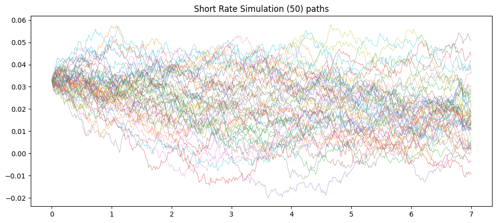
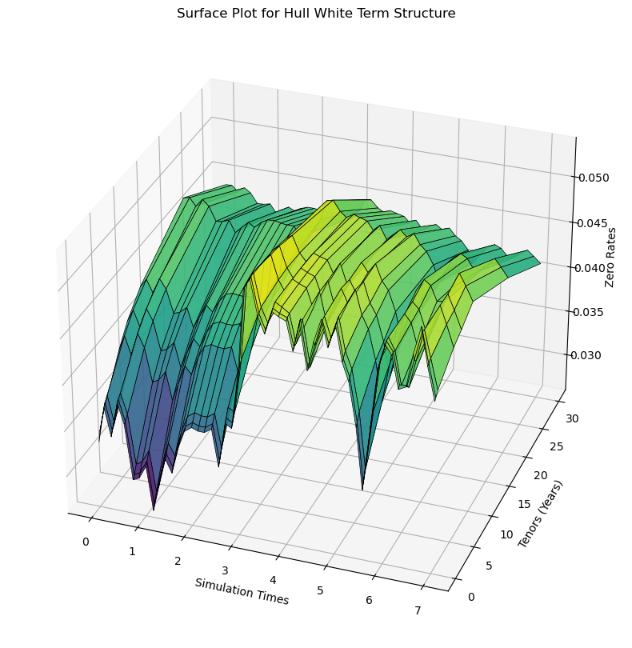
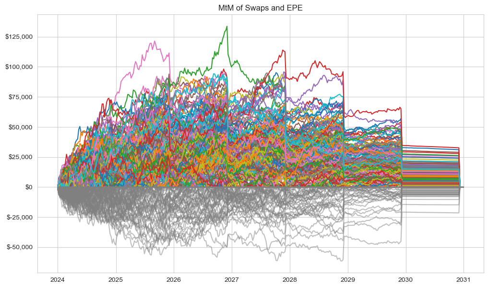
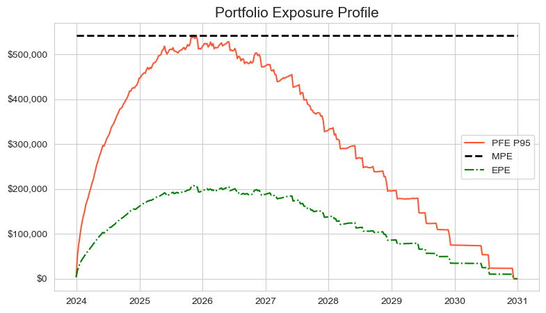
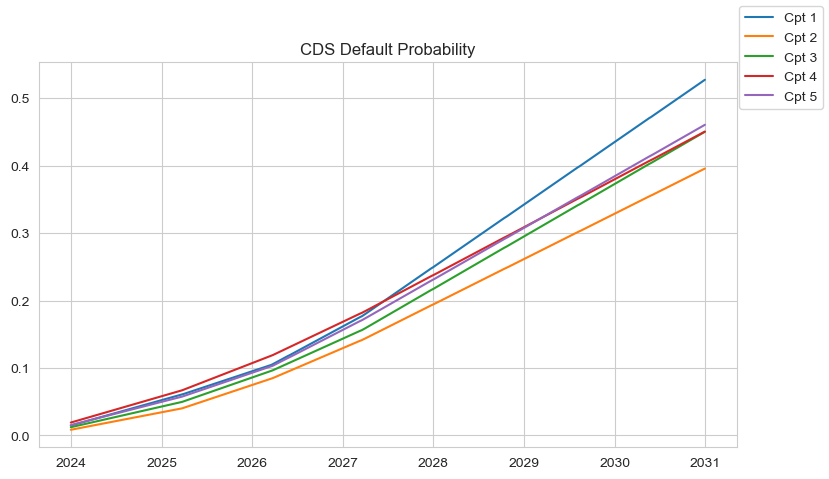

# Explanation of Hull-White 1-Factor Model Short Rate Simulation

I am unable to recall what really prompted me to do this, but I have always been very interested in computational finance, especially with applications of Monte Carlo within Financial Engineering and pricing Financial Derivatives. I've always heard in Wall Street to start simple, I guess it applies in every aspect of life. My first exposure to pricing models using Monte Carlo Simulations was with pricing options, from plain vanilla to Exotic/Asian options. From there, I've come a long way to calculating PFE on energy commodities and now CVAs on Interest Rate Swaps – perhaps the most convulated process I have ever undergone yet. 

Interest Rate Swaps are derivative contracts where a trader/speculator/hedger wants to gain/hedge exposure from rising/falling interest rates. These are Over the Counter (OTC) contracts where a Counterparty agrees to swap series of Fixed Interest payments on a notional value for a series of Floating Interest Rates on the same notional. Just like any other contract, the value of a derivative contract at inception should be Zero since there should be no free lunch albeit Arbitrage, but how does one simulate the exposure (value/Mark-to-Market) of this Interest Rate Swap as a walk forward into the future. That's where we use **Hull-White 1-Factor Model**, a widely used model for interest rate dynamics. Below, we explain the mathematical foundations and their implementation in the code.

 <b> *Note:* </b> <u> The code below utilizes vectorization as much as possible. There were certain loops I just couldn't avoid. Vectorization was faster by a magnitude of 20x at least. </u>

---

## Hull-White 1-Factor Model Dynamics

The Hull-White model is a powerful tool in financial mathematics for modeling the term structure of interest rates. It's a single-factor model that allows for the simulation of interest rate dynamics while maintaining consistency with the initial term structure.


We will use the model to simulate the short rate (instantaneous rate) using the below Stochastic Differential Equation (SDE) and then further calculate the full term structure:

$$
dr(t) = [\theta(t) - \alpha \cdot r(t)] \, dt + \sigma \, dW(t)
$$

Where:
- $r(t)$: Short rate at time $t$.
- $\theta(t)$: Time-dependent drift term, calibrated to fit the initial term structure of interest rates.
- $\alpha$: Speed of mean reversion (how fast the rate reverts to the mean).
- $\sigma$: Volatility of the short rate.
- $dW(t)$: Wiener process (standard Brownian motion).

---

## Discrete Simulation

The SDE is solved using a **discrete approximation**. The short rate $r(t)$ at time $t$ is given by:

$$
r(t) = r_0 \cdot e^{-\alpha t} + g(t) + \sigma \int_0^t e^{-\alpha (t - u)} \, dW(u)
$$

### Key Components
1. **Mean-Reverting Drift**:


$$
r_0 \cdot e^{-\alpha t}
$$

2. **Drift Adjustment for Term Structure**:


$$
g(t) = f(0, t) + \frac{\sigma^2}{2 \alpha^2} \cdot \left(1 - e^{-\alpha t}\right)^2
$$

- $f(0, t)$: Instantaneous forward rate at $t$ derived from the initial term structure.

3. **Stochastic Component**:


$$
\sigma \int_0^t e^{-\alpha (t - u)} \, dW(u)
$$

---

## Code Implementation

We start by defining our **Zero Curve** using quantLib python library and vectorize functions under the LogLinearZeroCurve methods. For simulations we will be using 5000 paths over 5 years with weekly intervals. The total number of simulations are $5000 * 7 * 52 = 1,560,000$ simulations. Using loops here should be considered criminal

```python

zeroRate = np.array([0.033, 0.034, 0.035, 0.040, 0.042, 0.044, 0.048, 0.044])
curveDate = [ql.Date(i.date().day, i.date().month, i.date().year) for i in dates]
zeroCurve = ql.LogLinearZeroCurve(curveDate, zeroRate, ql.Actual360(), calendar, ql.LogLinear(), ql.Compounded, ql.Continuous)
```


### 1. Parameters and Precomputations
- **$g(t)$**: Computes the drift adjustment for the term structure.
- **$r_0$**: The initial short rate, derived from the zero curve.
- **$f(0, t)$**: The instantaneous forward rate.
- **$g(t)$ values**: Combines $f(0, t)$ and $g(t)$ for deterministic adjustments.

```python

def fmT(t, PM):
    """Calculate the instantaneous forward rate at time t."""

    delta = 2 / 365  # 2 days as a fraction of a year
    return -(np.log(PM(t + delta)) - np.log(PM(t))) / (delta * 365) * 365

PM = lambda t: (
     zeroCurve.discount(t, True)
)
vectorizedPM = np.vectorize(PM)

g_t = lambda t: (sigma**2 / (2 * a**2)) * (1 - np.exp(-a * t))**2

r0 = zeroCurve.zeroRate(0, ql.Compounded, ql.Semiannual, True).rate()
f_t_0 = fmT(t, vectorizedPM)

gValues = f_t_0.T+ g_t(t)

exp_factors = np.exp(-a * np.arange(1, intervals+1) * dt)


exp_decay_matrix = np.exp(-a * (t[:, None] - t[None, :]))  # Creates a matrix of exp(-a*(t_i - t_j)). This is where it replaces the loop
exp_decay_matrix = np.tril(exp_decay_matrix)  # Make it lower triangular so that you're not including expired time
dW = np.random.normal(loc=0, scale=np.sqrt(dt), size = (paths, intervals))

stochastic = (sigma * exp_decay_matrix @ dW.T).T
drift = r0 * exp_factors + (gValues - gValues[0])

r = drift + stochastic
r = np.insert(r, 0, r0, axis = 1
              )

ratesStoch = pd.DataFrame(r.T, index= simTimes)

ratesStoch.sample(50, axis = 1).plot(figsize = (12, 5), alpha = 0.7, legend=False, lw  = 0.5)
```


---

### 2. Exponential Decay Factors
- **Exponential decay factors**:


$$ 
e^{-\alpha \Delta t} 
$$


Captures the exponential decay of the mean-reverting drift.

- **Exponential decay matrix**:


$$
e^{-\alpha (t_i - t_j)}
$$


Computes decay terms for $t_j \leq t_i$. i python it can depicted using the syntax ```t[:, None] - t[None, :]``` and then chosing the lower triangle so that 
you don't choose the matuirties beyond the date of simulation ```np.tril(exp_decay_matrix```

---

### 3. Stochastic Component
- **Brownian Motion Increments**:


$$
\Delta W \sim \mathcal{N}(0, \sqrt{\Delta t})
$$

- **Stochastic Integral Approximation**:


$$
\sigma \int_0^t e^{-\alpha (t - u)} \, dW(u)
$$


---

### 4. Drift and Final Short Rate
- **Drift**:


$$
r_0 \cdot e^{-\alpha t} + g(t) - g(0)
$$


- **Final Short Rate**:


$$
r(t) = \text{Drift} + \text{Stochastic}
$$

---

## Mathematical Summary

Adding all together gives us the eqution for the simulated short rate $r(t)$ at time t given by:

$$
r(t) = r_0 \cdot e^{-\alpha t} + \left[f(0, t) + \frac{\sigma^2}{2 \alpha^2} \cdot \left(1 - e^{-\alpha t}\right)^2 - g(0)\right] + \sigma \int_0^t e^{-\alpha (t - u)} \, dW(u)
$$

Where:
1. $r_0 \cdot e^{-\alpha t}$: Captures the mean-reverting behavior.
2. $f(0, t) + \dots$: Matches the initial term structure of rates.
3. $\sigma \int_0^t e^{-\alpha (t - u)} \, dW(u)$: Stochastic diffusion term.

This approach ensures the simulated short rates adhere to the Hull-White dynamics and are consistent with the initial term structure.


# Generating the Term Structure of Zero Rates at Each Simulation Date

Using the Hull-White 1-Factor model, the term structure of zero rates at each simulation date can be derived. This process ensures the short rate simulation aligns with the initial market term structure of interest rates and evolves consistently over time.

---

## Zero Rate Term Structure

Once you have simulated a path of the short rate, generate a full yield curve at each simulation date using the below formulae. The zero rate $R(t, T)$ for a maturity $T$ at simulation time $t$ is computed as:

$$
R(t, T) = -\frac{\ln P(t, T)}{T - t}
$$

Where:
- $P(t, T)$: Discount factor from time $t$ to time $T$.

The discount factor $P(t, T)$, which represents the present value of one unit of currency payable at time $(t)$, can be expressed in terms of $A(t, T)$, $B(t, T)$, and $\Gamma(T)$.


$$
P(t, T) = A(t, T) \cdot \exp\left(-B(t, T) \cdot r(t)\right)
$$

Where:
- $A(t, T)$: Adjustment term to match the initial term structure.
- $B(t, T)$: Sensitivity of the discount factor to the short rate $r(t)$.
- $r(t)$: Short rate at time $t$.

---

## Components of the Formula

### 1. $B(t, T)$
The function $B(t, T)$ captures the dependence of the discount factor on the short rate and is defined as:

$$
B(t, T) = \frac{1 - e^{-\alpha (T - t)}}{\alpha}
$$

- $\alpha$: Mean reversion parameter.
- $(T - t)$: Time to maturity.
- $B(t, T)$ decays exponentially as $t$ approaches $T$.

---

### 2. $\Gamma(T)$
The function $\Gamma(T)$ represents the accumulated variance of the short rate process between $t$ and $T$:

$$
\Gamma(T) = \frac{\sigma^2}{2 \alpha} \cdot \left(1 - e^{-2 \alpha (T - t)}\right)
$$

- $\sigma$: Volatility of the short rate.
- $\alpha$: Mean reversion parameter.
- $ T - t$: Time to maturity.

---

### 3. $A(t, T)$
The adjustment term $A(t, T)$ ensures the model aligns with the initial term structure of zero-coupon bonds. It is defined as:

$$
A(t, T) = \frac{P(0, T)}{P(0, t)} \cdot \exp\left(-\frac{1}{2} B(t, T)^2 \cdot \Gamma(T)\right)
$$

Where:
- $P(t, T)$: Price of a zero coupon bond at time $t$ that pays one dollar at time $T$.
 <br>
 <br>
 <br>

## Python Code

```python

gamma = lambda t: quad(lambda u: sigma**2 * np.exp(-2 * a * (t - u)), 0, t)[0]
gamma = np.vectorize(gamma)

A = lambda t, T: vectorizedPM(T) / vectorizedPM(t) * np.exp(-0.5 * B(t, T)**2 * gamma(t) + B(t, T) * fmT(t, vectorizedPM))
B = lambda t, T: (1 - np.exp(-a * (T - t))) / a

tT = simTimes + tenor[:, None]
AVal = (A(simTimes[1:], tT[:, 1:]))
BVal = B(simTimes[1:], tT[:, 1:])

rtT= np.zeros((len(simTimes), len(tenor), paths)) #initialize r(t,T)
rtT[0, :, :] = zeroRate[:, np.newaxis] # first term will be the zero curve at t = 0
ptT = AVal[None, :, :].T * np.exp((r[:, None, 1:] * -BVal[None, :, :])).T

rtT[1:, :, :] = -np.log(ptT)/tenor[None, :, None]
```

In the code above one may notice we had the tenors to each simulation time. This is because we're trying to ascertain the zero rates at each simulation time $t$ and the gap between $t$ and $T$ is nothing but the length of each tenor. Similarly $\frac{P(0,T)}{P(0,t)}$ is simulated base on on curve today and interpolated for time in the future. For eg, if $t = 0$ then $\max{T} = 30$ years. However if $t = 1$, then $T$ as of today is 31 years in the forward space. Thus we're computing the discount factor as both $t$ and $T$ walk forward.

---


## Resulting Term Structure

For each simulation time $t$:
- Compute $P(t, T)$ for all maturities $T$.
- Derive $R(t, T)$ for each maturity.

The result is a matrix of zero rates with:
- Rows representing simulation times.
- Columns representing maturities (tenors).

This term structure evolves dynamically over time and can be used for pricing interest rate derivatives or calculating exposures like CVA.

**By plotting one of the scenarios, we can see how our term structure looks.**

``` python
scen = 502
Z = rtT[:, :, scen].T


X,Y = np.meshgrid(simTimes, tenor)
fig = plt.figure()
fig = plt.figure(figsize=(8, 8))
ax = fig.add_subplot(111, projection='3d')

# Plot the surface
surface = ax.plot_surface(X, Y, Z, cmap='viridis', edgecolor='k', linewidth = 0.5, alpha = 0.99)

ax.set_xlabel("Simulation Times")
ax.set_ylabel("Tenors (Years)")
ax.set_zlabel("Zero Rates")

ax.set_title("Surface Plot for Hull White Term Structure")
ax.view_init(elev=20, azim=-70, roll=0)
fig.show()
```
<p align="center">
  
    <figcaption> <i>In the 3d chart above, if you take the Tenor 0 values for all simulation times, you will get the short rate simulation for that scenario (scenario 502) </i></figcaption>
</p>

----

Now of course there are 5000 of these surfaces you could create, but for demonstration purposes, as you move forward (right in the graph) through simulation time, each point then becomes the valuation date and you calculate the swap value as of that time based on the interest rate term structure
# Calcululating Swap Value and CVAs


## Step 1: Read the swap file

We first read the swap file and transform data for simplicity. Remember, each swap has a floating leg and a fixed rate leg, which corresponds to receiving or paying interest. This is represented by leg type column in the table.

| CounterpartyID | NettingID | Principal | Maturity | LegType | LegRateReceiving | LegRatePaying | LatestFloatingRate | Period |
| -------------- | --------- | --------- | -------- | ------- | ---------------- | ------------- | ------------------ | ------ |
| 5              | 5         | 813450    | 733921   | 1       | 0.036134726      | 10            | 0.03462651         | 1      |
| 5              |           | 441321    | 733873   | 0       | 87               | 0.039251637   | 0.033598155        | 1      |
| 1              |           | 629468    | 734917   | 1       | 0.038682219      | 0             | 0.035674961        | 1      |
| 5              |           | 774308    | 735461   | 0       | 70               | 0.046303151   | 0.035364042        | 1      |
| 4              |           | 918177    | 735800   | 1       | 0.047524758      | 74            | 0.034985981        | 1      |
| 1              | 1         | 969469    | 734039   | 0       | 78               | 0.040000628   | 0.03497566         | 1      |
| 2              | 2         | 660412    | 735001   | 0       | 8                | 0.0395239     | 0.034441285        | 1      |
| 3              |           | 353968    | 734783   | 1       | 0.041441865      | 36            | 0.03571308         | 1      |
| 5              | 5         | 361971    | 733781   | 1       | 0.036346283      | 23            | 0.034906748        | 1      |
....

Since the Period for each swap is 1, that implies the floating rate is reset annually, i.e, the payments are made/received every year with floating rate resetting at that date. LegType 1 means that the Leg Rate Receving is fixed and Leg Rate paying is a spread of 10bps above the floating rate at the time of reset. The *LatestFloatingRate* column shows the rate set at the last reset date. Thus, as we move in time (simulation time), we will have to calculate how the floating rate changes. For eg, let's say for simplicity, if today is October 1, 20x4 and the rate is reset every 31 December, then the last reset date was December 31, 20x3. Similarly, when we move through simulation time and the ```simTime``` is now January 31, 20x5, we will have to extrapolate or interpolate whatever the floating rate would have been on Decmber 31, 20x4. 

## Step 2: Generate Cash Flow Dates

This step involves generating dates when cash flows are exchange and when the floating rate is reset. We use the function ```genCFDates``` to do that.
This function generates cash flow dates and determines the last reset date for each simulation time.

**Notation:**
 - **Cash Flow Dates:** These are generated backward from maturity to settlement:
  $$
  \text{Cash Flow Dates} = \left[ T_i \, | \, T_i = T_{\text{maturity}} - \frac{k}{\text{freq}}, \, k = 0, 1, \ldots \right]
  $$
  Here:
  - $T_i$: Represents each cash flow date.
  - $\text{freq}$: The frequency of payments (e.g., annual, semi-annual, quarterly).

- **Last Reset Date:** The last reset date at any simulation time \( t_{\text{sim}} \) is determined as:
  $$
  \text{Last Reset Date} = \max \{ T_j \, | \, T_j \leq t_{\text{sim}} \}
  $$
  Here:
  - $T_j$: Represents a specific cash flow date.
  - $t_{\text{sim}}$: The current simulation time.

The function ensures that the last reset date remains consistent with the simulation timeline and adjusts based on the $T_j$ values.

In all cases, we will be using year fraction with day count $365$


```python
baseDate = datetime.datetime(16,1,1)
def genCFDates(maturity, legReset):
    floatDates = generateCashFlowDates(startDate - datetime.timedelta(365), maturity, legReset)
    cashFlowDates = np.array([(date - startDate).days/365 for date in floatDates][1:])

    lastResetDate = np.full(len(simTimes), cashFlowDates[0])
    cfIndex = 1
    for i, t in enumerate(simTimes):
        if cfIndex < len(cashFlowDates):
            if simTimes[i] < cashFlowDates[cfIndex]:
                lastResetDate[i] = cashFlowDates[cfIndex-1]
            else:
                cfIndex += 1
                lastResetDate[i] = cashFlowDates[cfIndex-1]
        else:
            lastResetDate[i] = lastResetDate[i-1]

    return cashFlowDates, lastResetDate

def generateCashFlowDates(settlementDate, maturityDate, frequency):
    """
    Generate cash flow dates.
    
    Parameters:
    - settlementDate (datetime): The start date of the cash flows.
    - maturityDate (datetime): The end date or maturity date.
    - frequency (int): The number of payments per year (1 for annual, 2 for semi-annual, 4 for quarterly, etc.).
    
    Returns:
    - list of datetime: List of cash flow dates from settlement to maturity.
    """
    # Calculate the interval in months between payments
    months = 12 // frequency

    # Generate cash flow dates by moving backwards from maturity to settlement
    dates = []
    currentDate = maturityDate
    while currentDate > settlementDate:
        dates.append(currentDate)
        currentDate -= relativedelta(months=months)

    dates.append(settlementDate)  # Include the settlement date as the first date if needed
    dates = sorted(dates)  # Sort dates in ascending order
    
    return dates

swapCouponDates = {}
swapLastResetDate = np.zeros(shape = (len(swaps), len(simTimes)))
for idx, swap in swaps.iterrows():
    swapCFDates, swapLastResetDate[idx, :] = genCFDates(swap.Maturity, swap.Period)
    swapCouponDates[swap.name] = swapCFDates

```

There are 30 swaps, and for each swap at each sim time, we want to know what the last floating rate was. The output for simTime and swapLastResetDate looks like below for swap number 4

Sim Time Number | Last Reset Date | Sim Time |
| --------------- | --------------- | -------- |
| 1               | \-0.38          | 0.000    |
| 2               | \-0.38          | 0.019    |
| 3               | \-0.38          | 0.038    |
| 4               | \-0.38          | 0.058    |
| 5               | \-0.38          | 0.077    |
| ....            
| 32              | \-0.38          | 0.596    |
| 33              | \-0.38          | 0.615    |
| 34              | 0.62            | 0.635    |
| 35              | 0.62            | 0.654    |
| 36              | 0.62            | 0.673    |
| 37              | 0.62            | 0.692    |
| 38              | 0.62            | 0.712    |
|...
| 84              | 0.62            | 1.596    |
| 85              | 0.62            | 1.615    |
| 86              | 1.62            | 1.635    |
| 87              | 1.62            | 1.654    |
|...


## Step 3: Find the Floating Rate at the last reset date
Per the table, on the first simulation date, the last reset done was $\approx 0.38$ years ago, based on swap data. We utilize the scipy.interpolate to find what the 1 year rates (since period is 1) would be at each reset date (based on the simulations we've done for each tenor and each sim date) and allow for left bound (minimum) values to the ones that are provided to us in the swap data. For example, when we're at sim Time 2 years let's, say and the floating rate was just reset, the interpolator will be calculating the 1 year tenor rate at that sim time. We do this becasue we don't have the exact rate for 1 year tenor at each sim date.

``` python
def computeIRSMtM(swaps, simTimes, zeroRates, tenors, lastResetDate):
    oneYrindex = np.where(tenors == 1)[0][0]
    oneYrRates = zeroRates[:, oneYrindex]

    latestFloatingRates = np.zeros(shape = (len(simTimes), swaps.shape[0], zeroRates.shape[2]))

    for idx, swap in swaps.iterrows():
        # at every last reset date you're interpolating the 1 year rate based on the interpolation of zero rates from simTime
        # This gives us the floating rate that was set at the reset date, which will be the first coupon of floating leg
        interpolator = interp1d(simTimes, oneYrRates, kind='linear', fill_value=swap.LatestFloatingRate, bounds_error=False, axis = 0)
        latestFloatingRates[:, idx] = interpolator(lastResetDate[idx])
....
```

If you go back to the surface plot, we're trying to find the points on the line across $\text 1 \space year \space Tenor$ from left to right. The latestFloatingRate has a shape of $(365,30)$ where 365 is the simulation time points (weekly for 7 years) and 30 swaps. 

## Step4: Compute Mark-to-Market for Swaps

Now that we have figured out what the floating reset dates were at the prior reset date for each simulation date, we can calculate the value of the swaps at each simulation date for each of the 5000 simulations. 

Note, by the no arbitrage theory, the swap value at inception is 0, therefore, any value henceforth is the MtM of that swap. 

For reference, I am using the methodology provided in *Options, Futures, and Other Derivatives* by John Hull. And to be even more speicifc, I am using the methodology where you treat swaps as an exchange of Forward Rate Agreements (FRA). You can also use the valuation of swaps by treating them as bonds with fixed and floating coupons, noting that the value of the floatig bond right before the payment is the notional value. 

**I use the function ```computeIRSMtM``` to caluclate the the values of swaps.**


---
<p align="center">
  
    
</p>


---
The chart above shows the Mark-to-Market of swap number 28 for 200 trajectories and the Positive Exposure. As the swap approaches maturity, the MtM converges to 0. The simulation number here is the trajectory number. 

## Step 5: Compute porfolio stats and CVA

The function ```computeIRSMtM``` gives us a distribution of MtM values for all swaps for 5000 trajectories and 365 simulation dates. Generally speaking, CVA is calculated on the Expected Positive exposure, which is the mean of positive exposure at any point. 


I perform this exercise for all counterparties and sum the values across all swaps for a counterparty. *Note:* For counterparties where netting is allowed, I sum both the positive and negative values of swaps whereas I aggregate only the positive values of swaps where there is no netting allowed. 

The way that I've calculated portfolio exposure is to take the positive exposure only, syou can decide to include all values for netted and non netted swaps and from there calculate expected positive exposure and expected exposure. By using my methodology, your expected exposure will be the same as expected positive exposure, as the graph below shows


<p align="center">
  
    
</p>


## Step 6: Finale － Calculate CVA

$$
\text{CVA} = (1-R) \int_0^T discEE(t)dPD(t)
$$

This can be be calculated using a discrete solution

$$
\text{CVA} \approx (1 - R) \sum_{i=1}^{N} \text{discEE}(t_i) \, \Delta \text{PD}(t_i)
$$

where 

- $\Delta{PD} = PDt_{i+1} - PDt_i$

- $discEE = Discounted\space Expected\space Positive\space Exposure$


Question then becomes, <b>How do we then calculate the Probability of Default at time $t$</b>. This can be done by using market observable CDS spreads. Note for valuation of CDS, $PV\space Premium\space Leg = PV\space Payout\space leg$


## 6.1. Premium Leg (Present Value of Premium Payments)

The premium leg involves periodic premium payments based on the CDS spread $s$. The protection buyer makes these payments as long as the reference entity hasn’t defaulted by the payment date.

For a small time interval $\Delta t$, the premium payment at time $t$ is given by:

$$
\text{Premium Payment at time } t = s \cdot N \cdot \Delta t
$$

The present value of the premium payment is discounted by the risk-free rate and weighted by the survival probability $S(t)$. Thus, the present value of the premium leg over the life of the CDS (from time $0$ to time $T$) is:

$$
\text{PV of Premium Leg} = s \cdot N \cdot \int_0^T S(t) \cdot e^{-r t} \, dt
$$

where:
- $S(t) = 1 - p(t)$ is the survival probability at time $t$,
- $e^{-r t}$ is the discount factor at time $t$.

You can use the discrete solution for the above equation for a small interval $\Delta t$

$$
\text{PV of Premium Leg} = s \cdot N \cdot \sum_{i=1}^{N} S(t_i) \cdot e^{-r t_i} \cdot \Delta t
$$

## 6.2. Protection Leg (Present Value of Protection Payments)

The protection leg involves payments that the protection seller makes in the event of a default. If default occurs at time $t$, the protection seller pays $N(1 - R)$, where $R$ is the recovery rate. The probability of default in the small interval $[t, t + \Delta t]$ is $p(t) - p(t - \Delta t)$, and the present value of the protection payment is discounted by the risk-free rate.

Thus, the present value of the protection leg is:

$$
\text{PV of Protection Leg} = (1 - R) \cdot N \cdot \int_0^T p(t) \cdot e^{-r t} \, dt
$$

where:
- $p(t)$ is the cumulative probability of default by time $t$,
- $e^{-r t}$ is the discount factor at time $t$.


Similarly for Protection Leg as well you could use the discrete version of the equation above: 

$$
\text{PV of Protection Leg} = (1 - R) \cdot N \cdot \sum_{i=1}^{N} p(t_i) \cdot e^{-r t_i} \cdot \Delta t
$$

## Summary of Key Components
- $S(t) = 1 - p(t)$ is the survival probability at time $t$, where $p(t)$ is the cumulative probability of default by time $t$.
- $r$ is the risk-free rate, assumed to be constant.
- $R$ is the recovery rate (so $1 - R$ is the loss given default).

## Interpretation
- **Numerator**: The expected protection payouts, discounted by the risk-free rate and weighted by the probability of default.
- **Denominator**: The expected premium payments, discounted by the risk-free rate and weighted by the survival probability.

This gives us the formula for the CDS spread $s$ in terms of the probability of default $p(t)$, the recovery rate $R$, and the risk-free rate $r$.

We utilize this formula to solve for Probability of Default using bootstrap method to get PD for all years, starting with year 1 all the way to year 7 (or max maturity), and use interpolation to fill in default probabilities for time we don't directly observe in the market


<p align="left">
  
    <figcaption><i>The image shows the Default Probability curves for each counterpart</i></figcaption>
</p>

And finally using the CVA formula we calculate the value and graph the results

