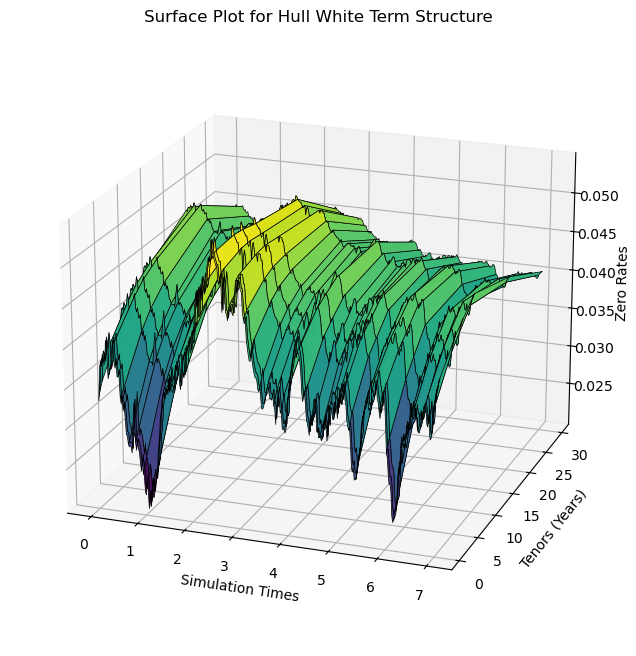

# Explanation of Hull-White 1-Factor Model Short Rate Simulation

I am unable to recall what really prompted me to do this, but I have always been very interested in computational finance, especially with applications of Monte Carlo within Financial Engineering and pricing Financial Derivatives. I've always heard in Wall Street to start simple, I guess it applies in every aspect of life. My first exposure to pricing models using Monte Carlo Simulations was with pricing options, from plain vanilla to Exotic/Asian options. From there, I've come a long way to calculating PFE on energy commodities and now CVAs on Interest Rate Swaps – perhaps the most convulated process I have ever undergone yet. 

Interest Rate Swaps are derivative contracts where a trader/speculator/hedger wants to gain/hedge exposure from rising/falling interest rates. These are Over the Counter (OTC) contracts where a Counterparty agrees to swap series of Fixed Interest payments on a notional value for a series of Floating Interest Rates on the same notional. Just like any other contract, the value of a derivative contract at inception should be Zero since there should be no free lunch albeit Arbitrage, but how does one simulate the exposure (value/Mark-to-Market) of this Interest Rate Swap as a walk forward into the future. That's where we use **Hull-White 1-Factor Model**, a widely used model for interest rate dynamics. Below, we explain the mathematical foundations and their implementation in the code.

The code below utilizes vectorization as much as possible. There were certain loops I just couldn't avoid. Vectorization was faster by a magnitude of 20x at least. 

---

## Hull-White 1-Factor Model Dynamics

The Hull-White model is a powerful tool in financial mathematics for modeling the term structure of interest rates. It's a single-factor model that allows for the simulation of interest rate dynamics while maintaining consistency with the initial term structure.


We will use the model to simulate the short rate (instantaneous rate) using the below Stochastic Differential Equation (SDE) and then further calculate the full term structure:

$$
dr(t) = [\theta(t) - \alpha \cdot r(t)] \, dt + \sigma \, dW(t)
$$

Where:
- $r(t)$: Short rate at time $t$.
- $\theta(t)$: Time-dependent drift term, calibrated to fit the initial term structure of interest rates.
- $\alpha$: Speed of mean reversion (how fast the rate reverts to the mean).
- $\sigma$: Volatility of the short rate.
- $dW(t)$: Wiener process (standard Brownian motion).

---

## Discrete Simulation

The SDE is solved using a **discrete approximation**. The short rate $r(t)$ at time $t$ is given by:

$$
r(t) = r_0 \cdot e^{-\alpha t} + g(t) + \sigma \int_0^t e^{-\alpha (t - u)} \, dW(u)
$$

### Key Components
1. **Mean-Reverting Drift**:


$$
r_0 \cdot e^{-\alpha t}
$$

2. **Drift Adjustment for Term Structure**:


$$
g(t) = f(0, t) + \frac{\sigma^2}{2 \alpha^2} \cdot \left(1 - e^{-\alpha t}\right)^2
$$

- $f(0, t)$: Instantaneous forward rate at $t$ derived from the initial term structure.

3. **Stochastic Component**:


$$
\sigma \int_0^t e^{-\alpha (t - u)} \, dW(u)
$$

---

## Code Implementation

We start by defining our **Zero Curve** using quantLib python library and vectorize functions under the LogLinearZeroCurve methods. For simulations we will be using 5000 paths over 5 years with weekly intervals. The total number of simulations are $5000 * 7 * 52 = 1,560,000$ simulations. Using loops here should be considered criminal

```python

zeroRate = np.array([0.033, 0.034, 0.035, 0.040, 0.042, 0.044, 0.048, 0.044])
curveDate = [ql.Date(i.date().day, i.date().month, i.date().year) for i in dates]
zeroCurve = ql.LogLinearZeroCurve(curveDate, zeroRate, ql.Actual360(), calendar, ql.LogLinear(), ql.Compounded, ql.Continuous)
```


### 1. Parameters and Precomputations
- **$g(t)$**: Computes the drift adjustment for the term structure.
- **$r_0$**: The initial short rate, derived from the zero curve.
- **$f(0, t)$**: The instantaneous forward rate.
- **$g(t)$ values**: Combines $f(0, t)$ and $g(t)$ for deterministic adjustments.

```python

def fmT(t, PM):
    """Calculate the instantaneous forward rate at time t."""

    delta = 2 / 365  # 2 days as a fraction of a year
    return -(np.log(PM(t + delta)) - np.log(PM(t))) / (delta * 365) * 365

PM = lambda t: (
     zeroCurve.discount(t, True)
)
vectorizedPM = np.vectorize(PM)

g_t = lambda t: (sigma**2 / (2 * a**2)) * (1 - np.exp(-a * t))**2

r0 = zeroCurve.zeroRate(0, ql.Compounded, ql.Semiannual, True).rate()
f_t_0 = fmT(t, vectorizedPM)

gValues = f_t_0.T+ g_t(t)

exp_factors = np.exp(-a * np.arange(1, intervals+1) * dt)


exp_decay_matrix = np.exp(-a * (t[:, None] - t[None, :]))  # Creates a matrix of exp(-a*(t_i - t_j)). This is where it replaces the loop
exp_decay_matrix = np.tril(exp_decay_matrix)  # Make it lower triangular so that you're not including expired time
dW = np.random.normal(loc=0, scale=np.sqrt(dt), size = (paths, intervals))

stochastic = (sigma * exp_decay_matrix @ dW.T).T
drift = r0 * exp_factors + (gValues - gValues[0])

r = drift + stochastic
r = np.insert(r, 0, r0, axis = 1
              )

ratesStoch = pd.DataFrame(r.T, index= simTimes)

ratesStoch.sample(50, axis = 1).plot(figsize = (12, 5), alpha = 0.7, legend=False, lw  = 0.5)
```


---

### 2. Exponential Decay Factors
- **Exponential decay factors**:


$$ 
e^{-\alpha \Delta t} 
$$


Captures the exponential decay of the mean-reverting drift.

- **Exponential decay matrix**:


$$
e^{-\alpha (t_i - t_j)}
$$


Computes decay terms for $t_j \leq t_i$. i python it can depicted using the syntax ```t[:, None] - t[None, :]``` and then chosing the lower triangle so that 
you don't choose the matuirties beyond the date of simulation ```np.tril(exp_decay_matrix```

---

### 3. Stochastic Component
- **Brownian Motion Increments**:


$$
\Delta W \sim \mathcal{N}(0, \sqrt{\Delta t})
$$

- **Stochastic Integral Approximation**:


$$
\sigma \int_0^t e^{-\alpha (t - u)} \, dW(u)
$$


---

### 4. Drift and Final Short Rate
- **Drift**:


$$
r_0 \cdot e^{-\alpha t} + g(t) - g(0)
$$


- **Final Short Rate**:


$$
r(t) = \text{Drift} + \text{Stochastic}
$$

---

## Mathematical Summary

Adding all together gives us the eqution for the simulated short rate $r(t)$ at time t given by:

$$
r(t) = r_0 \cdot e^{-\alpha t} + \left[f(0, t) + \frac{\sigma^2}{2 \alpha^2} \cdot \left(1 - e^{-\alpha t}\right)^2 - g(0)\right] + \sigma \int_0^t e^{-\alpha (t - u)} \, dW(u)
$$

Where:
1. $r_0 \cdot e^{-\alpha t}$: Captures the mean-reverting behavior.
2. $f(0, t) + \dots$: Matches the initial term structure of rates.
3. $\sigma \int_0^t e^{-\alpha (t - u)} \, dW(u)$: Stochastic diffusion term.

This approach ensures the simulated short rates adhere to the Hull-White dynamics and are consistent with the initial term structure.


# Generating the Term Structure of Zero Rates at Each Simulation Date

Using the Hull-White 1-Factor model, the term structure of zero rates at each simulation date can be derived. This process ensures the short rate simulation aligns with the initial market term structure of interest rates and evolves consistently over time.

---

## Zero Rate Term Structure

Once you have simulated a path of the short rate, generate a full yield curve at each simulation date using the below formulae. The zero rate $R(t, T)$ for a maturity $T$ at simulation time $t$ is computed as:

$$
R(t, T) = -\frac{\ln P(t, T)}{T - t}
$$

Where:
- $P(t, T)$: Discount factor from time $t$ to time $T$.

The discount factor $P(t, T)$, which represents the present value of one unit of currency payable at time $(t)$, can be expressed in terms of $A(t, T)$, $B(t, T)$, and $\Gamma(T)$.


$$
P(t, T) = A(t, T) \cdot \exp\left(-B(t, T) \cdot r(t)\right)
$$

Where:
- $A(t, T)$: Adjustment term to match the initial term structure.
- $B(t, T)$: Sensitivity of the discount factor to the short rate $r(t)$.
- $r(t)$: Short rate at time $t$.

---

## Components of the Formula

### 1. $B(t, T)$
The function $B(t, T)$ captures the dependence of the discount factor on the short rate and is defined as:

$$
B(t, T) = \frac{1 - e^{-\alpha (T - t)}}{\alpha}
$$

- $\alpha$: Mean reversion parameter.
- $(T - t)$: Time to maturity.
- $B(t, T)$ decays exponentially as $t$ approaches $T$.

---

### 2. $\Gamma(T)$
The function $\Gamma(T)$ represents the accumulated variance of the short rate process between $t$ and $T$:

$$
\Gamma(T) = \frac{\sigma^2}{2 \alpha} \cdot \left(1 - e^{-2 \alpha (T - t)}\right)
$$

- $\sigma$: Volatility of the short rate.
- $\alpha$: Mean reversion parameter.
- $ T - t$: Time to maturity.

---

### 3. $A(t, T)$
The adjustment term $A(t, T)$ ensures the model aligns with the initial term structure of zero-coupon bonds. It is defined as:

$$
A(t, T) = \frac{P(0, T)}{P(0, t)} \cdot \exp\left(-\frac{1}{2} B(t, T)^2 \cdot \Gamma(T)\right)
$$

Where:
- $P(t, T)$: Price of a zero coupon bond at time $t$ that pays one dollar at time $T$.
 <br>
 <br>
 <br>

## Python Code

```python

gamma = lambda t: quad(lambda u: sigma**2 * np.exp(-2 * a * (t - u)), 0, t)[0]
gamma = np.vectorize(gamma)

A = lambda t, T: vectorizedPM(T) / vectorizedPM(t) * np.exp(-0.5 * B(t, T)**2 * gamma(t) + B(t, T) * fmT(t, vectorizedPM))
B = lambda t, T: (1 - np.exp(-a * (T - t))) / a

tT = simTimes + tenor[:, None]
AVal = (A(simTimes[1:], tT[:, 1:]))
BVal = B(simTimes[1:], tT[:, 1:])

rtT= np.zeros((len(simTimes), len(tenor), paths)) #initialize r(t,T)
rtT[0, :, :] = zeroRate[:, np.newaxis] # first term will be the zero curve at t = 0
ptT = AVal[None, :, :].T * np.exp((r[:, None, 1:] * -BVal[None, :, :])).T

rtT[1:, :, :] = -np.log(ptT)/tenor[None, :, None]
```

In the code above one may notice we had the tenors to each simulation time. This is because we're trying to ascertain the zero rates at each simulation time $t$ and the gap between $t$ and $T$ is nothing but the length of each tenor. Similarly $\frac{P(0,T)}{P(0,t)}$ is simulated base on on curve today and interpolated for time in the future. For eg, if $t = 0$ then $\max{T} = 30$ years. However if $t = 1$, then $T$ as of today is 31 years in the forward space. Thus we're computing the discount factor as both $t$ and $T$ walk forward.

---


## Resulting Term Structure

For each simulation time $t$:
- Compute $P(t, T)$ for all maturities $T$.
- Derive $R(t, T)$ for each maturity.

The result is a matrix of zero rates with:
- Rows representing simulation times.
- Columns representing maturities (tenors).

This term structure evolves dynamically over time and can be used for pricing interest rate derivatives or calculating exposures like CVA.

**By plotting one of the scenarios, we can see how our term structure looks.**

``` python
scen = 502
Z = rtT[:, :, scen].T


X,Y = np.meshgrid(simTimes, tenor)
fig = plt.figure()
fig = plt.figure(figsize=(8, 8))
ax = fig.add_subplot(111, projection='3d')

# Plot the surface
surface = ax.plot_surface(X, Y, Z, cmap='viridis', edgecolor='k', linewidth = 0.5, alpha = 0.99)

ax.set_xlabel("Simulation Times")
ax.set_ylabel("Tenors (Years)")
ax.set_zlabel("Zero Rates")

ax.set_title("Surface Plot for Hull White Term Structure")
ax.view_init(elev=20, azim=-70, roll=0)
fig.show()
```
<p align="center">
  
</p>
